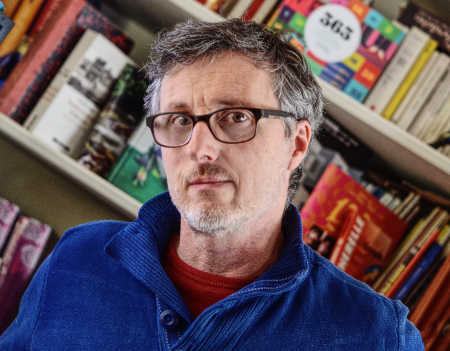

Hervé Saint-Macary est concepteur graphique et élabore des sites sur-mesure et accessibles.
<a class="a-propos-mail-to" href="mailto:contact@vitreene.com?&subject=Prendre%20contact%20avec%20Hervé">Contactez-moi</a>

Les technologies employées sont principalement :

- pour l’intégration HTML/CSS : **Sass**, **Knacss**.
- pour le développement front-end : javascript, **React / Redux**, Vue.js  
- CMS, **Wordpress** : création de thèmes et types de contenus personnalisés.
- générateur de site statique : Phenomic,  MetalSmith.

Membre actif du [Meetup Wordpress Marseille](https://www.meetup.com/fr-FR/Marseille-WordPress-Meetup/)

### Making-of
Ce site est construit grâce à [Phenomic](http://phenomic.io), un générateur de sites statiques basé sur des composants React.

<!--intro-->