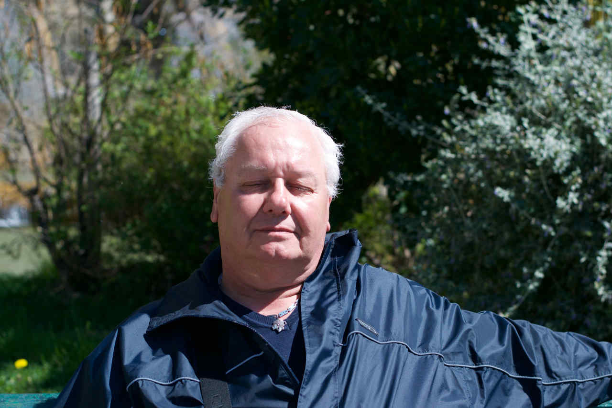

Appelé pour un lifting du site, les échanges avec cette association qui à pour sujet la basse vision ont conduit à prendre plusieurs décisions sur la construction de son design.

<!--intro-->

## Un site adaptatif
Pour améliorer le confort de lecture, le site exploite la largeur entière de la fenêtre ; les css n’emploient que des unités relatives, en pourcentages et root-em.
Les couleurs, qui suivent celles de logo, sont perçues avec peu de dégradation par les personnes atteintes de [daltonisme](http://www.daltonize.org).

Chaque information est isolée sur un pavé de couleur, avec un unique lien par pavé, pour minimiser les erreurs.
Les textes sont en fort contraste avec leur fond ; le site passe les tests sur **[webaim.org](http://wave.webaim.org/)**
Le code contient les attributs Wai-aria nécessaires à un bon repérage audio.

Le **[Numéro vert](http://www.svaplus.fr/actualites-et-travaux/la-charte-signaletique-des-numeros-sva-8493689-1049.html)**, dont il n’existe pas à ma connaissance de version accessible, a été remonté en css pour y accéder en lecture audio, et, sur les mobiles, à appeler le numéro.

Enfin, la prise de vue de la photo principale a donné lieu à quelques retouches : les écouteurs ne se voyant pas suffisamment, ils ont été ajoutés en post-production…

[Le site de l'Arradv.](https://www.arradv.net)
<aside class="notes">
</aside>
