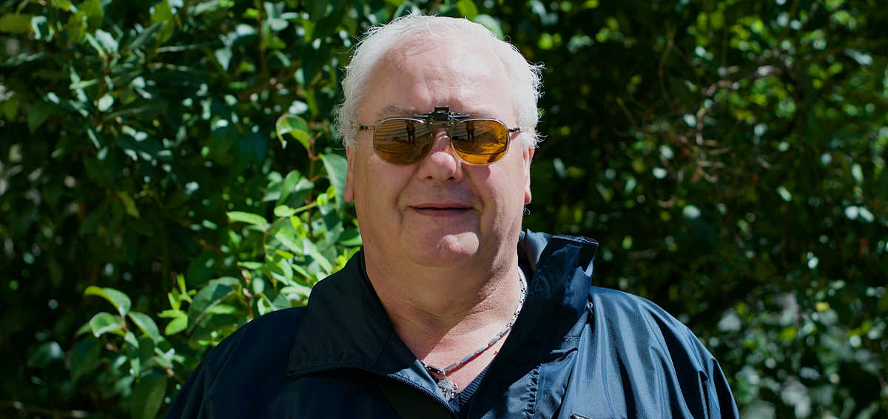

L’Arradv est une association qui réunit des professionnels de santé et propose des aides aux personnes victimes de déficience visuelle. 

En faisant le constat d’une risque amplifié de désocialisation, un parcours medico-social a d’abord été mis en place pour rendre de l’autonomie et réinsérer ces personnes handicapées.
Récemment, un centre d’appel a été créé. De portée nationale, il est entièrement dédié aux questions touchant ce domaine.

Pour la refonte de leur site, il semblait évident de proposer une solution qui prenne en  compte l’accessibilité.




<!--intro-->


## Mettre le WAI partout.
Le **Web Accessibility Initiative**[1](#note01)  est une spécification officielle permettant d’améliorer l’usage pour les malvoyants des interfaces des sites modernes.

Wai-aria consiste à enrichir les contenus d’un site  par des indications sur son fonctionnement propre&nbsp;:

- les éléments sont décrits par leur rôle&nbsp;: comment distinguer, par exemple, une liste de liens en fin d’article, d’une autre  liste dans un menu&nbsp;? Ce dernier se verra attribué un rôle&nbsp;: «&nbsp;navigation&nbsp;»
- toute action qui modifie l’état de la page est signalé&nbsp;: ce bouton est-il cliqué,  ce menu déroulant est-il déplié ou replié&nbsp;?
- enfin, il faut aussi prévenir si du contenu a changé&nbsp;:  un utilisateur se connecte à son compte, il est prévenu que le menu principal s’est enrichi de nouvelles options.


Wai-aria est compatible avec les principaux lecteurs d’écran du marché.

## L'accessibilité, c'est aussi visible
Le site est **adaptatif**. Pour améliorer le confort de lecture, le site adapte sa taille pour occuper toute la surface disponible.

Il est aussi **responsif**&nbsp;: les composants des pages sont réorganisés dynamiquement pour tenir compte des contraintes des petits écrans des smartphones. Sur ces appareils, le numéro de téléphone du centre d’appel est valorisé comme action principale.

L’aspect du site tient compte de l’accessibilité&nbsp;: la gamme de couleurs, le fort contraste des textes permet de passer les tests du site spécialisé **[webaim.org](http://wave.webaim.org/)**.

Chaque pavé de contenu ne contient qu’un seul lien, et toute la surface est cliquable. 
Testée en interne par l’association, la combinaison de ces dispositifs permet de proposer une expérience adaptée à son public. 

[Le site de l'Arradv.](https://www.arradv.net)

**Intéressé par un site accessible ? [Etudions la question ensemble.](../contact)**


<aside class="notes">

### Technique : rendre le Numéro vert accessible.
Les numéros SVA[2](#note02)  utilisent une charte signalétique et mettent à disposition un ensemble de fichiers graphiques. Cependant, un lecteur d’écran n’est pas en mesure de lire le contenu de ces images pour y interpreter un numéro de téléphone. 

Un texte alternatif ne suffit pas non plus, ce numéro doit être reconnu sur un téléphone mobile. La solution proposée est la suivante&nbsp;:

- Le cadre et les indications secondaires sont sur en image de fond&nbsp;;
- le numéro de téléphone est textuel. 
- du texte complémentaire est caché visuellement, mais accessible aux lecteurs d’écran. 

Les navigateurs liés à un téléphone savent détecter automatiquement le format d’un numéro, et le transforme à la volée en lien vers l’application d’appel. L’apparence est modifiée, il convient d’ajouter dans ce cas des règles css.


<div class="no-vert">
<span class="element-invisible">Téléphone : </span>
0800 013 010
<span class="element-invisible"> (Service et appel gratuit)</span>
</div>
<style>
.no-vert {
  <!--outline: 1px solid red;-->
  height: 4rem;
  line-height: 4rem;
  padding-left: 1rem;
  margin:2rem 0;
  color: #78B41E;
  font-family: Arial, sans-serif;
  font-weight: bold;
  font-size: 1.9rem;
  letter-spacing: 0;
  background-image: url("../../assets/img/No-vert-fond.png");
  background-size: contain;
  background-repeat: no-repeat;
 }
.no-vert  a[href^=tel] {
    color: #78B41E;
    text-decoration: none;
  }
.element-invisible {
  position: absolute !important;
  height: 1px; width: 1px;
  overflow: hidden;
  clip: rect(1px 1px 1px 1px); /* IE6, IE7 */
  clip: rect(1px, 1px, 1px, 1px);
}
</style>

le code html :
```html
<div class="no-vert">
<span class="element-invisible">Téléphone : </span>
0800 013 010
<span class="element-invisible"> (Service et appel gratuit)</span>
</div>

```

et les styles : 

```css
.no-vert {
  width: 100%;
  height: 4rem;
  line-height: 4rem;
  padding-left: 1rem;
  color: #78B41E;
  font-family: Arial, sans-serif;
  font-weight: bold;
  font-size: 1.9rem;
  letter-spacing: 0;
  background-image: url('No-vert-fond.png');
  background-size: contain;
  background-position-x: 50%;
  background-repeat: no-repeat;
 }

.no-vert  a[href^=tel]{
    color: #78B41E;
    text-decoration: none;
  }

.element-invisible {
  position: absolute !important;
  height: 1px; width: 1px;
  overflow: hidden;
  clip: rect(1px 1px 1px 1px); /* IE6, IE7 */
  clip: rect(1px, 1px, 1px, 1px);
}
```


</aside>


<aside class="notes">
<h2>Notes</h2>
<ul>
<li id="note01">

[Les questions autour de Wai-aria](https://www.w3.org/WAI/ARIA/faq)

</li>
<li id="note02">

[La charte graphique du Numéro vert](http://www.svaplus.fr/actualites-et-travaux/la-charte-signaletique-des-numeros-sva-8493689-1049.html)
</li>
</ul>
</aside>
