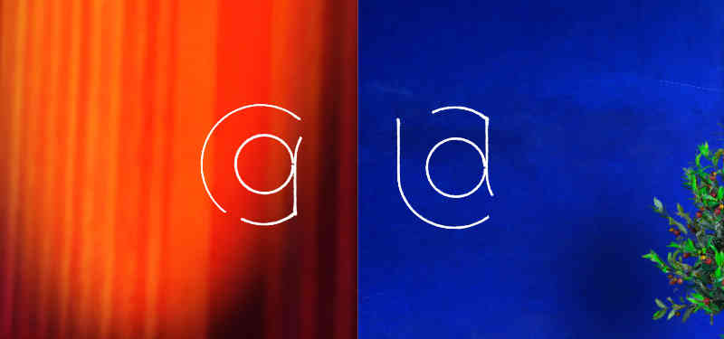

Linarès architectures est une agence de micro-projets, qui apporte  une réflexion contextuelle pour des architectures adaptées et sur-mesure.
Elle propose aussi, avec Carolina Garcia, du design d’intérieur et une spécialisation dans l’adaptation des locaux au handicap ou la vieillesse.

La création du site a été l’occasion de créer l’identité visuelle de l’agence.

<!--intro-->

## Un duo de lignes claires
Le monogramme reprend les initiales L-A et C-G., le «&nbsp;g&nbsp;» est le «&nbsp;a&nbsp;» inversé du premier pour créer cet effet de proximité.

Il est dessiné au trait, pour évoquer le plan d’architecte, le fait-main pour l’approche sur-mesure, et… pour une traduction approchante de lin(ar)es&nbsp;!

Selon l'utilsation prévue, le logo principal est décliné en plusieurs formats : le logo usuel pour la papeterie, le logo-signature sur les plans.

## Des pictos coordonnés
Le site internet reprend l'usage des lignes notament dans la série de pictos créés pour l’occasion. L’utilisation de seulement deux couleurs renforce l’effet de famille.
Ces pictos sont destinés à illustrer l'ensemble des services que propose l'agence.

<svg xmlns="http://www.w3.org/2000/svg" fill-rule="evenodd" stroke-miterlimit="1.41" viewBox="0 0 129 155" clip-rule="evenodd" stroke-linejoin="round">   <g fill="none" stroke-width="5.02" stroke-linecap="round">    <path stroke="#5cc964" d="M38.68 64.24C22.3 67.72 9.38 80.32 5.53 96.62c-5.5 23.26 8.9 46.6 32.15 52.12 21.3 5.05 43.02-6.6 50.6-27.13"/>    <path stroke="#5cc964" d="M23.93 101.7c-2.36 8.62.46 17.84 7.25 23.66 9.7 8.3 24.3 7.2 32.62-2.5 7.62-8.87 7.4-22.03-.48-30.66"/>    <path stroke="#1397e1" d="M124.47 124.18l-15.45 6.62-22.08-41.1H44.98l-13.25-53 4.37-8.2m2.26 34.7h45.26"/>    <circle cx="44.43" cy="17.6" r="13.25" stroke="#1397e1"/>  </g></svg>
<svg xmlns="http://www.w3.org/2000/svg" fill-rule="evenodd" stroke-miterlimit="1.41" viewBox="0 0 162 151" clip-rule="evenodd" stroke-linejoin="round">  <g fill="none" stroke-width="5.02" stroke-linecap="round">    <path stroke="#5cc964" d="M102.94 96.74h13v15.6h-13zm0 25.98h13v23.38h-13z"/>    <path stroke="#5cc964" d="M102.94 122.72h13v23.38h-13zm-34.42 0h21.23v23.38H68.52zm-21.66 0H68.1v23.38H46.85z"/>    <path stroke="#5cc964" d="M128.18 87.36v58.73H27.98v-33.8m-5.56-15.58l40.13 3.2 76.76-26.58"/>    <path stroke="#1397e1" d="M4.35 53.7s18.15 36.14 57.3 28.6c39.15-7.56 95.72-59.75 95.72-59.75"/>    <path stroke="#1397e1" d="M19.23 38.12S32.88 75.54 55.36 71.9c22.48-3.66 85-62.35 85-62.35"/>    <path stroke="#1397e1" d="M34.1 28.74s5.6 30.22 19.13 27.56C66.77 53.65 108.5 4.35 108.5 4.35"/>    <path stroke="#1397e1" d="M46.86 19.94s.58 26.75 6.37 23.38c5.8-3.4 21.27-38.98 21.27-38.98"/>  </g></svg>
<svg xmlns="http://www.w3.org/2000/svg" fill-rule="evenodd" stroke-miterlimit="1.41" viewBox="0 0 146 152" clip-rule="evenodd" stroke-linejoin="round"> <g stroke-width="5.02" stroke-linecap="round">     <path fill="none" stroke="#5cc964" d="M42.04 4.35s6.63 32.53 56.02 53.08"/> <path fill="#fff" stroke="#1397e1" d="M42.04 26.6h44.73v12.07H42.04zm54.38 108.74h44.73v12.08H96.42zM58.24 48.98h28.52v12.08H58.24zm38.18 63.96h28.52v12.08H96.42zm-27-41.56h17.35v12.08H69.43zm27 19.16h17.34v12.08H96.42z"/> <path fill="#fff" stroke="#5cc964" d="M86.77 20.15h9.65V147.4h-9.65z"/>    <path fill="none" stroke="#5cc964" d="M98.06 57.43s31.34 14.17 43.1 42.55"/>
    <g fill="#fff">      <path stroke="#5cc964" d="M4.35 68.56h51.52v76.56H4.35z"/>      <path stroke="#5cc964" d="M4.35 68.56h17.48v34.76H4.35zm34.05 0h17.47v34.76H38.4z"/>      <path stroke="#1397e1" d="M21.34 68.56h17.48v34.76H21.34z"/>      <path stroke="#5cc964" d="M4.35 112.65h17.48v34.76H4.35zm34.05 0h17.47v34.76H38.4z"/>      <path stroke="#1397e1" d="M21.34 112.65h17.48v34.76H21.34z"/>      <path stroke="#5cc964" d="M18.64 95.8h22.9v22.08h-22.9z"/>      <path stroke="#1397e1" d="M25.5 102.43h9.46v9.12H25.5z"/>    </g>  </g></svg>
<svg xmlns="http://www.w3.org/2000/svg" fill-rule="evenodd" stroke-miterlimit="1.41" viewBox="0 0 128 134" clip-rule="evenodd" stroke-linejoin="round">  <g fill="none" stroke-width="5.02" stroke-linecap="round">    <path stroke="#5cc964" d="M25.94 81.8L7.7 80.68l2.6-41.5L20 30.6l8.55 9.7-2.6 41.5zm28.8 1.83L36.5 82.48l3.55-56.45 9.7-8.55 8.54 9.7-3.58 56.45zm28.8 1.8L65.3 84.3l4.5-71.4 9.7-8.55 8.54 9.7-4.5 71.4z"/>    <path stroke="#1397e1" d="M98.62 31.66l24.55 48.6-9.06 4.3-1.42 26.77L78 128.66 4.33 101.28"/>  </g></svg>
<svg xmlns="http://www.w3.org/2000/svg" fill-rule="evenodd" stroke-miterlimit="1.41" viewBox="0 0 148 162" clip-rule="evenodd" stroke-linejoin="round">  <g fill="none" stroke-width="5.02">    <g stroke="#1397e1">      <path d="M4.35 94.65l29.7-29.7c-1.18-1.93-2.2-3.96-3.13-6.02-1.6-3.55-2.87-7.24-4-10.96-1.18-3.97-2.16-8-3.03-12.05-1.3-5.82-2.2-11.7-3.1-17.58m55.3 72.5l4 3.08 2.5 1.96c2.5 2.04 5.1 4.1 7.5 6.36l.7.7c2.7-2.05 5.4-4.07 8.2-6.07l-8.7-9.42-14.3 3.4zm-45.4-74.7l.4 3.34c.7 4.8 1.5 9.6 2.5 14.35.7 3.27 1.5 6.5 2.4 9.72.9 3.06 1.9 6.1 3 9.04.3.8.7 1.7 1.1 2.5 0 0 22.3-9.7 22.7-9.7 1.6-.1 3 .9 4.2 2 6.55 5.8 13.86.7 15.06.1 1.4-.7 28.6-19.6 30.45-21.2"/>      <path d="M117.72 35.4c-3.33 2.7-30.33 21-32.7 22.1-3.6 1.67-10.16 3.96-16.94 2.2-2.38-.62-4.77-1.4-6.73-2.92l-15.74 7 1.5 1.65c2.1 2.37 14.8 14.07 19 17.48l25-5.9c.3 0 4.6 1.2 4.9 1.5l12.5 13.6c.1 0 5.3 0 6.5.3.9.3 1.7.6 2.4.9 2.7 1.3 5 3.3 6.8 5.6 1.1 1.4 16.9 30.4 18.8 34.2"/>      <path d="M133.77 137.53c-.75-1.48-18.18-33.1-18.35-33.3-.95-1.06-2.16-2.04-3.6-2.3-.24-.05-1.5-.05-1.9.04-.4.1-.8.22-1.2.4l-.07.04c-4.04 3.1-8.12 6.1-12.25 9.1.13.5.25 1 .34 1.5.35 1.9.57 3.9.47 5.8-1 18.8-5.3 34.7-6.3 39m-9.5-3.5c1.2-5.1 2.3-10.2 3.3-15.4.6-3.2 2.2-13.5 2.3-15.4.1-1.3 1.8-8.5-4.2-14.2-1.1-1-6.9-5.8-8.7-7.2-3-2.3-24.8-19.7-30.5-25.5-1.1-1.1-2.1-2.2-3.2-3.4L11.6 102"/>    </g>    <g stroke="#5cc964" stroke-linecap="round">      <path d="M48.1 90.67l-7.54 7.54-7.53-7.5 7.53-7.5 7.54 7.6zm8.55 6.53L51 103.45l-7.26-7.54-7.53 7.6 17.6 17.6 14.1-14.2-11.2-9.6zm56.77 18.94l4.6 8.67-10.4 5-4.95-14.8 10.75 1.2z"/>      <path d="M68.2 107.1l-9.46 8.73 20.4 15.82.87-14.74-11.8-9.8zm-27.64 1.37l-12.28 12.56 7.93 8.7 13.9-11.6-9.5-9.67zm38.18 23.18l-9.36 18.47-10.63-8.2 10.63-17.1 9.36 6.83zm28.65-1.9l-5.8 2.9 1.7 23.34 18.5-7.9-2.7-4.8 6.7-4-8-14.6-10.6 4.9zM85.1 71.6l-17.8 5.6 4.55-10.75 11.72-1.65 1.56 6.8z"/>      <path d="M98.42 58l1.97 13.6H85.2l-1.73-6.46L98.42 58zm2.14 14.2l10.35 12.4 17.6-1.47-2.5-15.36-9.8 1.07-5.8-18.25-12 7.4 2.2 14.2zm-.16-67.85L77.52 15.1l11 21.32L108.4 20.5l-8-16.15z"/> <path d="M72.8 42.82l-8.67-15.2L80.1 19.6l8.44 16.77-15.73 6.45z"/>    </g>  </g></svg>

Les titres, quant à eux, sont composés en Raleway Light.
Le site est actuellement en construction, ce qui n’a jamais fait peur à un architecte.

### [www.linares-architectures.com](http://www.linares-architectures.com)

<aside class="notes">
</aside>
