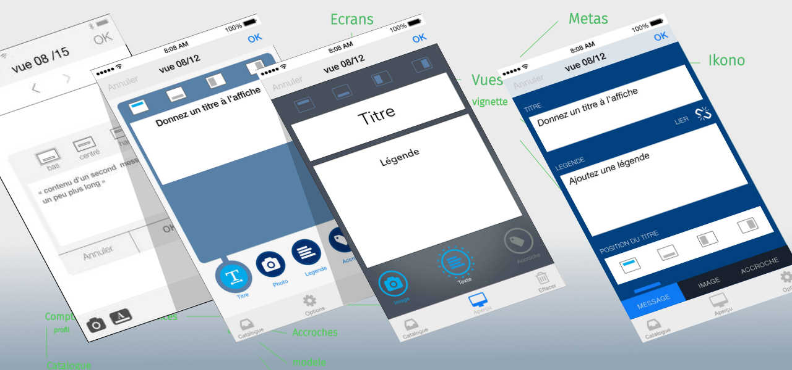

J’avance, lentement mais surement, sur mon side-project qui est un support pour employer des technos front-end de référence.
Le projet, en deux mots, est un sytème d’affiche dynamique. composé de deux applis, un éditeur et le projecteur.

L’éditeur permet la mise à jour instantanée des vues diffusées, ainsi qu’une télécommande. Le projecteur diffuse en boucle un carrousel de vues.

<!--intro-->

## Les composants du projet

Le front-end de l'éditeur est réalisé avec React ; Redux gère les états, et à terme, permettra ajouter une fonction d'undo/redo.

Le back-end est sous Meteor, avec lequel j'avais déjà réalisé un premier prototype. Meteor est très commode pour installer en peu de temps un environnement de travail, notamment le back-end sur lequel je ne voulais pas passer trop de temps. Il est possible que je finisse par le remplacer, c'est pourquoi je n'utilise pas sa partie front qui, de plus aurait interféré avec Redux.

J'envisageai React aussi pour la partie projecteur, mais j'ai rencontré des difficultés pour gérer le carousel de vues. Lorsque j'ai conçu mon portfolio, j'ai eu à trouver une solution pour gérer correctement les transitions entre deux vues. React n'a pas de fonction particulière des états de disparition et d'apparition d'un élément au meme endroit ([un composant react](https://www.npmjs.com/package/react-css-transition-replace) est apparu depuis).

<svg xmlns="http://www.w3.org/2000/svg" viewBox="0 0 160 157">
  <path fill="#de4f4f" d="M0 0l137.1 145.24s4.7 3.3 8.26-.55c3.57-3.9.82-7.7.82-7.7L0 0zm43.42 13.73l104.4 112.56s4.68 3.3 8.25-.6c3.58-3.9.83-7.7.83-7.7L43.42 13.7zM12.9 43.1l104.43 112.57s4.67 3.3 8.24-.55c3.58-3.84.83-7.7.83-7.7L12.9 43.1zm67.22-17.57l72.95 78.65s3.26 2.3 5.76-.4c2.5-2.67.57-5.36.57-5.36l-79.28-72.9zM22.96 77.15L95.9 155.8s3.28 2.3 5.77-.4c2.5-2.68.58-5.36.58-5.36l-79.3-72.9zm94.64-34.6l33.07 35.76s1.6 1.1 2.85-.1c1.23-1.23.28-2.5.28-2.5l-36.2-33.1zM41.22 113.4l33.06 35.74s1.6 1.08 2.85-.18c1.23-1.26.28-2.5.28-2.5L41.3 113.4z">
</path>
</svg>
<svg xmlns="http://www.w3.org/2000/svg" viewBox="0 0 600 600"><circle cx="299.53" cy="299.63" r="50.17" fill="#00D8FF">
</circle>  <path fill="none" stroke="#00D8FF" stroke-width="24" stroke-miterlimit="10" d="M299.53 197.63c67.36 0 129.93 9.66 177.1 25.9 56.85 19.57 91.8 49.24 91.8 76.1 0 28-37.04 59.5-98.08 79.73-46.15 15.3-106.88 23.27-170.82 23.27-65.55 0-127.63-7.5-174.3-23.44-59.03-20.2-94.6-52.2-94.6-79.6 0-26.68 33.37-56.1 89.4-75.6 47.37-16.5 111.48-26.4 179.5-26.4z">
</path>  <path fill="none" stroke="#00D8FF" stroke-width="24" stroke-miterlimit="10" d="M210.74 248.92c33.64-58.35 73.28-107.72 110.92-140.48 45.35-39.46 88.5-54.92 111.77-41.5 24.25 13.98 33.04 61.8 20.07 124.8-9.8 47.6-33.24 104.2-65.18 159.6-32.75 56.78-70.25 106.8-107.37 139.27-47 41.1-92.4 56-116.2 42.3-23.07-13.3-31.9-56.92-20.82-115.23 9.35-49.27 32.83-109.75 66.8-168.67z">
</path>  <path fill="none" stroke="#00D8FF" stroke-width="24" stroke-miterlimit="10" d="M210.82 351.48c-33.74-58.3-56.73-117.28-66.3-166.25-11.55-59-3.4-104.1 19.85-117.57 24.23-14.02 70.06 2.25 118.14 44.94 36.4 32.28 73.7 80.84 105.8 136.17 32.86 56.74 57.48 114.2 67.05 162.6 12.1 61.2 2.3 107.97-21.45 121.73-23.07 13.34-65.26-.8-110.25-39.5-38-32.7-78.7-83.26-112.76-142.12z">
</path></svg>
<svg xmlns="http://www.w3.org/2000/svg" viewBox="0 0 100 100">
  <g fill="#764ABC"><path d="M65.6 65.4c2.9-.3 5.1-2.8 5-5.8-.1-3-2.6-5.4-5.6-5.4h-.2c-3.1.1-5.5 2.7-5.4 5.8.1 1.5.7 2.8 1.6 3.7-3.4 6.7-8.6 11.6-16.4 15.7-5.3 2.8-10.8 3.8-16.3 3.1-4.5-.6-8-2.6-10.2-5.9-3.2-4.9-3.5-10.2-.8-15.5 1.9-3.8 4.9-6.6 6.8-8-.4-1.3-1-3.5-1.3-5.1-14.5 10.5-13 24.7-8.6 31.4 3.3 5 10 8.1 17.4 8.1 2 0 4-.2 6-.7 12.8-2.5 22.5-10.1 28-21.4z">
</path>    <path d="M83.2 53c-7.6-8.9-18.8-13.8-31.6-13.8H50c-.9-1.8-2.8-3-4.9-3h-.2c-3.1.1-5.5 2.7-5.4 5.8.1 3 2.6 5.4 5.6 5.4h.2c2.2-.1 4.1-1.5 4.9-3.4H52c7.6 0 14.8 2.2 21.3 6.5 5 3.3 8.6 7.6 10.6 12.8 1.7 4.2 1.6 8.3-.2 11.8-2.8 5.3-7.5 8.2-13.7 8.2-4 0-7.8-1.2-9.8-2.1-1.1 1-3.1 2.6-4.5 3.6 4.3 2 8.7 3.1 12.9 3.1 9.6 0 16.7-5.3 19.4-10.6 2.9-5.8 2.7-15.8-4.8-24.3z">
</path>    <path d="M32.4 67.1c.1 3 2.6 5.4 5.6 5.4h.2c3.1-.1 5.5-2.7 5.4-5.8-.1-3-2.6-5.4-5.6-5.4h-.2c-.2 0-.5 0-.7.1-4.1-6.8-5.8-14.2-5.2-22.2.4-6 2.4-11.2 5.9-15.5 2.9-3.7 8.5-5.5 12.3-5.6 10.6-.2 15.1 13 15.4 18.3 1.3.3 3.5 1 5 1.5-1.2-16.2-11.2-24.6-20.8-24.6-9 0-17.3 6.5-20.6 16.1-4.6 12.8-1.6 25.1 4 34.8-.5.7-.8 1.8-.7 2.9z">
</path></g>
</svg>
<svg xmlns="http://www.w3.org/2000/svg" viewBox="0 0 400 400"><path fill="#4dba87" d="M237.42 86.66L207.2 139l-30.23-52.34H76.3l130.9 226.68L338.06 86.66z">
</path>  <path fill="#435466" d="M237.42 86.66L207.2 139l-30.23-52.34h-48.3l78.52 136 78.5-136z">
</path></svg>

J'ai trouvé l'alternative avec Vue.js, une librairie assez proche de React, notamment dans sa v2 toute récente qui prend en charge JSX. Vue autorise gère aisément les transitions entre deux composants, avec une gestion des états identique à ce que propose React (enter, enter-active). Redux se combine bien avec Vue, cependant, il existe une solution dédiée, Vuex.

Après un prototype de test monté avec Vue, je reprend le projet pour y intégrer de nouvelles idées. Une démo fonctionnelle est encore prématurée, mais [le code du projet est visible ici](https://github.com/vitreene/editeur/tree/master/src), en l'état.

<aside class="notes">
</aside>
