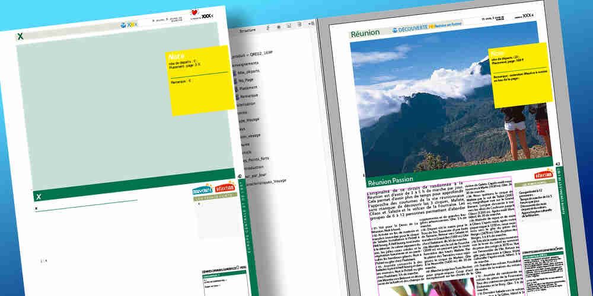
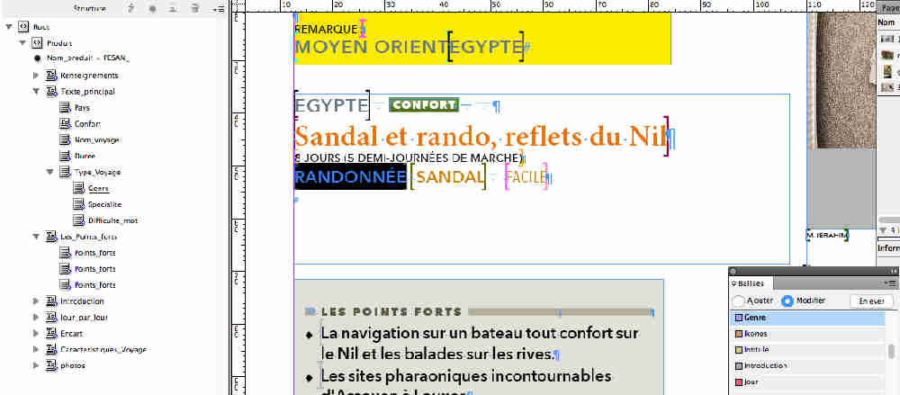
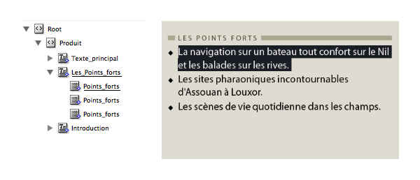
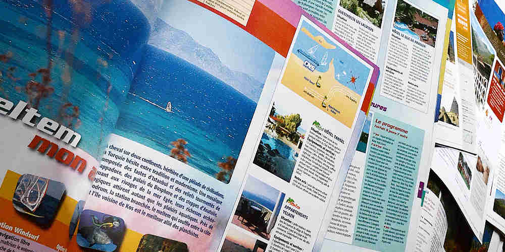

_*«&nbsp;Write once, display everywhere.&nbsp;»*_ Intégrer une base de données dans un flux de publication, comme on le pratique pour le web, n’est pas évident à organiser quand il s'agit d'un catalogue papier[1](#note01).

Il existe aujourd'hui de nombreux services de web-to-print[2-4](#note02). En fonction de l’organisation de l’entreprise, de l’ampleur du projet, internaliser un studio maquette le temps de la production est un aussi choix à considérer. Il facilite l'accès aux ressources documentaires internes ainsi que le travail collaboratif.

Il s'agit alors d'élaborer des passerelles pour relier la base de données au logiciel de PAO.


<div id="post-hero-video-wrapper" class="post-hero-video-wrapper"> <video id="post-hero-video" preload="auto" autoplay="true" loop poster="../../assets/img/pages-brochures.jpg" width="100%">   <source src="../../assets/img/pages-brochuresNB4.webm"  type="video/webm">  <source src="../../assets/img/pages-brochuresNB3.mp4"  type="video/mp4"> </video> <div class="gradient-filter"></div>
</div>


<!--intro-->


## Organiser le studio interne
L'équipe s'organise autour de deux fonctions&nbsp;:
- Un coordinateur est chargé de s'assurer de la disponibilité des données et gère le planning de production.
- Le responsable du studio gère l'équipe de maquettistes, veille au respect de la charte graphique, et adapte au besoin les maquettes produites.

## Concevoir le design de la brochure
Passer du web au papier pose la contrainte de l’espace limité de la feuille de papier. Pour garder un confort de lecture, il va falloir filtrer les informations essentielles pour repérer le produit, le comprendre et le comparer.  

La création graphique est testée avec des contenus réels, choisis selon les contraintes qu’ils représentent&nbsp;: notice longue, moyenne ou courte, nombreuses images, image unique ou absente…  Les résultats permettent de définir quel sera le résultat optimal. On en déduit les règles de compositions, les directives de rédaction, le calibrage des notices, ainsi que les éléments descriptifs finalement retenus.  

Le principe de maquette validé, il faut  préparer le modèle d’importation pour la brochure, et le cas échéant, mettre à jour la base de données pour refléter les décisions de publication.



## Créer un modèle d’importation
Le gabarit de maquette est adapté pour intégrer les balises XML. Les balises sont ordonnées et regroupées selon l’ordre de lecture. À chaque balise est associée une feuille de style.

Chaque balise est ensuite appliquée dans un bloc texte ou graphique dans la maquette. Plusieurs balises peuvent se suivre à l'intérieur d'un même bloc.

La plupart du temps, plusieurs produits seront présents sur une même page ; s'ils sont présentés de la même façon, ils peuvent etre importés en une seule fois, inDesign se charge de recopier le modèle à chaque fois.

Dans d'autres cas, il faut importer les produits un par un, et leur attribuer un gabarit propre. Dans ce cas, ces gabarits sont enregistrés dans une bibliothèque, et seront disponibles à tout moment. Des variantes peuvent être imaginées selon que l'on pose le gabarit sur une page paire ou impaire…

## Préparer la base de données
La validation de la maquette entraîne parfois des adaptations de la base de données. C’est notamment le cas si le calibrage des notices impose une réécriture.

D’autres adaptations, comme le résultat d'un calcul, la représentation d'une valeur sous forme de pictogramme, sont réalisés dynamiquement au moment de l’importation des données.

Les données sont extraites sous forme de balisage XML. Les fonctions sont disponibles dans la plupart des frameworks ou cms, où il sont généralement utilisés pour gérer des flux RSS.

Si possible, préférer un balisage «&nbsp;plat&nbsp;», sans hiérarchiser les données.



## Adapter le format d’exportation
Le fichier XML est destiné à être importé dans inDesign. La plupart du temps, le fichier produit n’est pas exploitable directement par la maquette&nbsp;: l'importation doit suivre l'ordre de présentation des informations. Par exemple, si, sur la maquette, le nom d’un produit est suivi de son prix, alors ce doit être aussi le cas dans le XML.

Pour cela, les transformations à appliquer sont décrites par un script rédigé en XSL. Ce script sera appliqué au moment de l’importation dans Indesign&nbsp;; une préférence est prévue à cet effet.

**Voyons un exemple, avec un redressement&nbsp;:** dans la base, le champ «&nbsp;points forts&nbsp;»  contient une liste&nbsp;; la convention de rédaction consiste à placer un tiret en début de ligne pour chaque point. La transformation va retirer ce tiret pour placer la ligne dans une balise `<Points_forts>`&nbsp;, et le groupe est ensuite encadré par une balise `<Les_Points_forts>`.

le XML d'origine, issu de la base&nbsp;:

```xml
[ ... ]
<pts_forts>
- La navigation sur un bateau tout confort sur le Nil et les balades sur les rives.
- Les sites pharaoniques incontournables d'Assouan à Louxor.
- Les scènes de vie quotidienne dans les champs.
</pts_forts>
[ ... ]

```

le xsl contient les règles de transformation&nbsp;:

```xml
<xsl:variable name="MarqueDeParagraphe">
	<xsl:text>&#xa;</xsl:text>
</xsl:variable>

[ ... ]
<Les_Points_forts>
	<xsl:for-each select="//Points_forts">
		<Points_forts>

<!—- retirer le tiret en début de ligne -—>
		<xsl:value-of select="substring-after (normalize-space(.), '- ')"/>

<!—- retirer les espaces en excès -—>
		<xsl:value-of select="normalize-space(.)"/>

<!—- ajouter une marque de paragraphe en fin de ligne, -—>
<!—- sauf sur le dernier -—>
		<xsl:if test ="position() != last()">
			<xsl:value-of select="$MarqueDeParagraphe"/>
		</xsl:if>

		</Points_forts>
	</xsl:for-each>
</Les_Points_forts>
[ ... ]
```
le  XML  transformé&nbsp;:

```xml
[ ... ]
<Les_Points_forts>
	<Points_forts> La navigation sur un bateau tout confort sur le Nil et les balades sur les rives.</Points_forts>
	<Points_forts> Les sites pharaoniques incontournables d'Assouan à Louxor.</Points_forts>
	<Points_forts>Les scènes de vie quotidienne dans les champs.</Points_forts>
</Les_Points_forts>
[ ... ]
```
Le résultat, importé dans la maquette&nbsp;:



Le passage par une transformation XSL apporte une grande souplesse dans la mise au point de la maquette&nbsp;; il n’est pas rare qu’une demande de dernière minute nécessite, par exemple, des modifications dans l’ordre des informations&nbsp;; la source des données n’est pas touchée et la modification réalisée par le studio, rapide.

Il est possible, en gardant la même source, de créer des variantes de présentation, il suffit pour cela de créer un autre fichier XSL avec d'autres règles de transformation. On pourra aussi obtenir une fiche détaillée, une liste résumée, un index…

<aside class="post-aparte">


XSL[5-6](#note05) est un langage assez peu connu et d'une logique assez complexe&nbsp;; toutefois, les transformations à créer pour ce type d’usage sont triviales&nbsp;: il s’agit la plupart du temps de modifier le nom d’une balise, d’en changer l’ordre ou leur imbrication.


</aside>

## Les images
Le meme principe&nbsp;: *write once…* s’applique aussi aux images. Si l’on part d’une base de données produit, il est probable que lui soit associée une base d’images. Il faut utiliser les fichiers sources, et éviter les versions optimisées pour l’affichage du site.

Pour être utilisables pour le web, elle sont en mode RVB. Il est tout à fait possible de garder les images dans ce format pour les exploiter dans inDesign dans un flux d’impression. Simplement, la conversion en CMJN n’aura lieu qu’au moment de la production des PDF destinés à l’imprimeur[7](#note07).

Le spectre des couleurs reproductible en impression étant sensiblement plus limité, il faut être vigilant en réglant l’aperçu des images simulant à l’écran l’impression papier, pour éviter les verts fluo flatteurs qui grisent à l’impression.



## En fin de compte, les meilleures pages se font à l'usine.
Tout ce qui est répétitif peut être automatisé[8](#note06). Le temps de préparation important réserve plutôt son emploi pour de gros projets. Ce type d’importation permet non seulement le formatage et l’application de styles à la volée, mais aussi le placement dans les divers éléments de la maquette. L’importation de photos est géré, et grâce aux scripts de transformation, des filtrages conditionnels peuvent être envisagés.

L’importation directe, sans manipulation par le maquettiste, réduit le cycle de corrections qui est un poste important en temps passé. Les corrections peuvent s’envisager en toute confiance en amont de la maquette, hors du temps de l’urgence, et donc de façon plus efficace.

Plus la maquette est complexe, plus le résultat comportera des défauts de composition qu’il faut régler : le maquettiste reste dans ce dispositif une partie essentielle pour le sens de la composition, l’équilibrage des contenus, le choix et le cadrage des photos. Avec l’expérience, il vaut mieux d’ailleurs ne pas chercher à tout régler d’avance, mais de créer les règles suffisantes pour la majorité des cas.

La touche finale revient de toute façon au maquettiste&nbsp;!


### Sur le portfolio : les magazines
exemples de  catalogues :
clubaventure, femmes du monde, golf


<aside class="notes">
<h2>Notes</h2>
<ul>
<li id="note01">

[Dépassé le papier ?](http://www.lemonde.fr/m-styles/article/2015/05/08/le-catalogue-papier-allie-surprenant-de-la-vente-en-ligne_4629601_4497319.html) Ce n’est pas nécessairement l’avis de tous.

</li>
<li id="note02">

[Importation automatique](http://automatisation.kerosine.fr/automatisation) de bases de données dans Indesign.
</li>
<li>

Une solution [collaborative](http://www.nextpage.fr) via une web app
</li>
<li>

Une autre [solution](http://fr.pageondemand.com)
</li>

<li id="note05">

initiation à  [xslt](https://www.guillaumevoisin.fr/developpement/tutoriel-apprendre-les-feuilles-de-style-xslt).
</li>
<li>

Une autre [dossier sur xslt](http://fsajous.free.fr/xml/xslt/xslt.html) plus complet.
</li>

<li id="note07">

Travailler en [flux RVB]( http://https://www.video2brain.com/fr/tuto/travailler-avec-un-flux-rvb-pour-les-images-et-exporter-en-pdf).
</li>
<li id="note08">

Pour tout savoir sur l'import XML dans inDesign&nbsp;: [lisez le manuel](https://helpx.adobe.com/fr/indesign/using/importing-xml.html)&nbsp;!
</li>
</ul>
</aside>
