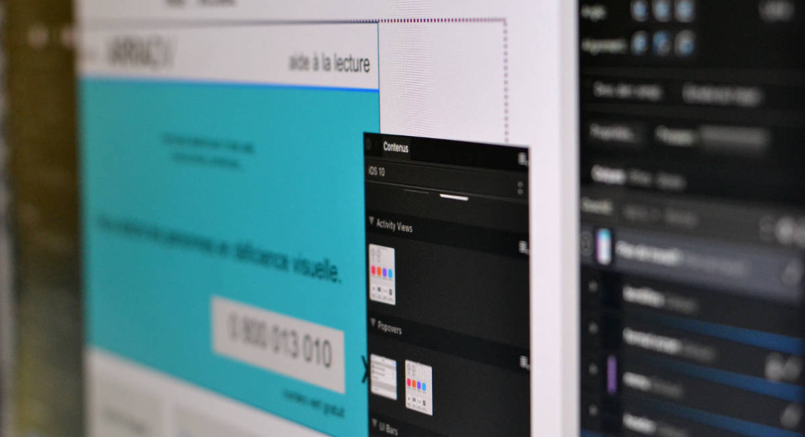

Votre site ne vous donne plus entière satisfaction, vous envisagez une refonte&nbsp;; ou au contraire, vous portez un tout nouveau projet&nbsp;? Vous êtes accompagnés dans chaque étape.

<!--intro-->

## Avant la construction 
Après exposition du projet et la définition des objectifs que vous aurez determiné, l’arborescence du site est produite.
Les contenus texte, video, photos, logo, sont recueillis ou créés au besoin. 
Les composants fonctionnels sont identifiés&nbsp;: formulaires, cartes, carousel…
Nous en tirons les lignes conductrices pour construire le propos de la page d’accueil.

Vous avez réuni ces éléments, nous pouvons construire le site.

## La réalisation du site 
Cette partie commence par la création d'un thème visuel unique qui sera ensuite codé. Dans certains cas, il sera possible d’utiliser un thème déjà réalisé qui sera personnalisé.
Les pages créées sont révisées et validées au fur et à mesure. Après d’ultimes révisions, le site est livré.

## Améliorer le site
Il est avantageux de penser l’optimisation du site dès sa conception Plusieurs types d’améliorations peuvent se combiner ensemble pour de meilleurs résultats&nbsp;:
- optimisation pour le référencement naturel (SEO),
- optimisation pour l’accessibilité, prise en compte des handicaps… et des robots d’indexation.
- optimisation du temps de chargement des pages (minification, AMP, cache, cdn…)
- sécurisation avancée du site (https, htaccess).

## Entretien 
Le suivi de correction des bugs, l’archivage et les mise à jours sont assurés trois mois après la publication du site. Au delà, un plan de maintenance est proposé&nbsp;; une formation est possible si vous souhaitez vous en charger vous même.

Vous avez un projet ? [Parlons-en ensemble !](../contact)

